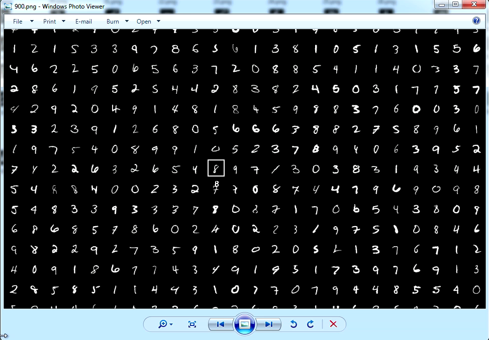

# A CNN(Convolutional Neural Network) hardware implementation

This project is an attempt to implemnt a harware CNN structure. 

The code is written by Verilog/SystemVerilog and Synthesized on Xilinx FPGA using Vivado.

The code is just experimental for function, not full optimized.

## Architecture 

Only 4 elementary modules implemented:
- The conv, this module perform the convolution computing, the full connecting is also treated the same as convolution with the kernel size equal to input data size.
- The max_pool
- The relu
- The iterator, jogging around the input data, and feed the computing units.

## Demo

A LeNet is constructed using the 4 elementary modules, the weights and biases are hard coded in ROM.

The reference Tenserflow Lenet code is from [ CarND-LeNet-Lab ](https://github.com/udacity/CarND-LeNet-Lab).

Xilinx KCU105 Board, with HDMI input and output daughter boards is used.

Connect a PC to the HDMI input daughter through a HDMI cable.
 
A 32x32-size input is cropped from the PC screen output, then fed into the Lenet. The classified result is displayed on the HDMI output.

The following pic is cropped from the HDMI output of FPGA. The white rectangle is draw by FPGA. Move a Mnist digit picture into the rectangle, or draw a digit by hand using a Paint software. The printed digit under the rectangle is the the classified result.

## Conclusion

- Pure RTL hardware design is not a good choice for neural networks. Especially for large scale networks, the weights and intermediate results need to be stored in external memory. And the data iterator will be more complex. It's better to use a general or specific processor to do the control works, and let the hardware to perform computing.  

## Reference

[ CarND-LeNet-Lab ](https://github.com/udacity/CarND-LeNet-Lab).

## Author

LulinChen  
lulinchen@aliyun.com
